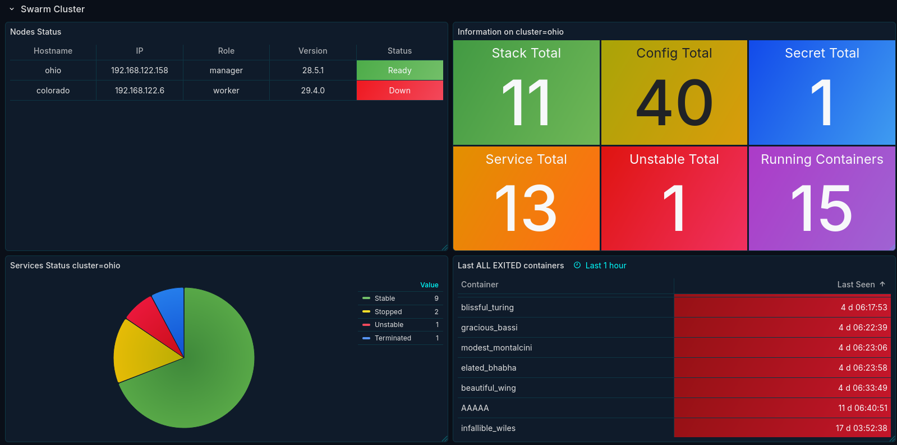
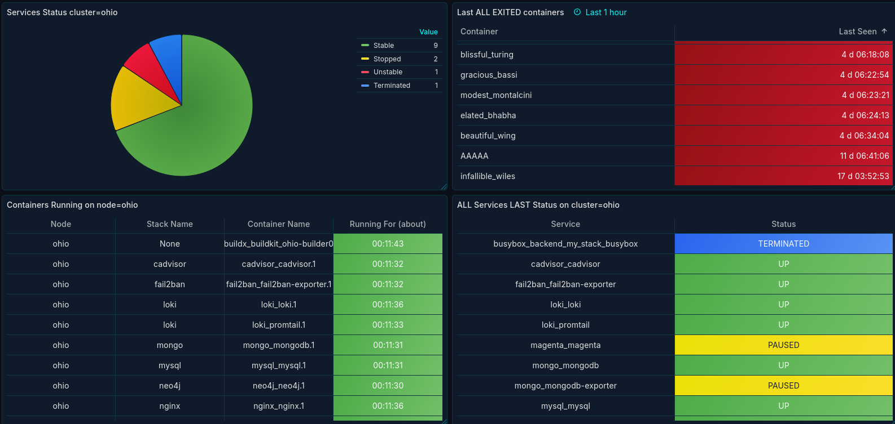

This scrape gets information of the cluster using the `/var/run/docker.sock` file. It should be deployed to all the machines in the cluster. A Dockerfile is provided for building the image. A systemd service file is also provided to run the scrape as a service.
## Installation

**Docker**

```bash
docker build -p 9595:8080 -v /var/run/docker.sock:/var/run/docker.sock -t prom-swarm-scrape:latest .
```

Default container port: 8080.

**System**

```bash
pip3 install python3-docker
./prom-swarm-scrape.py --port 9595 # default port
```

## Prometheus

The name of the cluster is on the label `swarm_cluster`. A label named `node` is inserted representing the name of the node.

Example of a cluster with 3 nodes:

- node00, 192.168.122.1 (master)
- node01, 192.168.122.2
- node02, 192.168.122.3

```text
 - job_name: 'swarm-cluster00'  
   static_configs:  
     - targets: ['192.168.122.1:9595', '192.168.122.2:9595', '192.168.122.3:9595']  
       labels:  
         swarm_cluster: cluster00  
   relabel_configs:  
     - source_labels: [__address__]  
       regex: '192.168.122.1:9595'  
       target_label: 'node'  
       replacement: 'node00'  
     - source_labels: [__address__]  
       regex: '192.168.122.2:9595'  
       target_label: 'node'  
      replacement: 'node01'  
     - source_labels: [__address__]  
       regex: '192.168.122.3:9595'  
       target_label: 'node'  
       replacement: 'node02'
```

## Metrics

| Metric Name                    | Type  | Value                                                | Description                                                                                                                                                                             |
| ------------------------------ | ----- | ---------------------------------------------------- | --------------------------------------------------------------------------------------------------------------------------------------------------------------------------------------- |
| swarm_configs_total            | Gauge | Number                                               | Total number of configs                                                                                                                                                                 |
| swarm_containers_exited_total  | Gauge | Number                                               | Total number of exited containers on the node                                                                                                                                           |
| swarm_containers_running_total | Gauge | Number                                               | Total number of running containers on the node.                                                                                                                                         |
| swarm_containers_status        | Gauge | Number (seconds)                                     | Uptime of the container in seconds                                                                                                                                                      |
| swarm_nodes_status             | Gauge | 1 (ready), 0 (down)                                  | Node is Ready (1) or Down (0)                                                                                                                                                           |
| swarm_nodes_total              | Gauge | Number                                               | Total number of nodes                                                                                                                                                                   |
| swarm_secrets_total            | Gauge | Number                                               | Total number of secrets                                                                                                                                                                 |
| swarm_services_status          | Gauge | 0 (stable), 1 (paused), 2 (unstable), 3 (terminated) | **Stable**: replicas == desired != 0<br>**Paused**: replicas == desired == 0<br>**Unstable**: replicas != desired and is not a job<br>**Terminated**: replicas != desired and is a job. |
| swarm_services_total           | Gauge | Number                                               | Total number of services                                                                                                                                                                |
| swarm_services_unstable_total  | Gauge | Number                                               | Total number of unstable services (replicas != desired)                                                                                                                                 |
| swarm_stacks_total             | Gauge | Number                                               | Total number of stacks                                                                                                                                                                  |

## Example

```text
1)
swarm_containers_status{state="running", stack="nginx", service_name="nginx_nginx", name="nginx_nginx.3.waqt4226uiwgbstl108c4f330", sho  
rt_name="nginx_nginx.3"} 20365

Container state="running" from service service_name="nginx_nginx" of the stack="nginx" is running for 20365 seconds.

2)
swarm_containers_status{state="exited", stack="None", service_name="None", name="quizzical_lumiere", short_name="quizzical_lumiere"} 292381

Exited ontainer with no association with any Stack was last seen 292381 seconds ago.

3)
swarm_services_status{service_name="loki_promtail", stack="loki"} 1

Service "loki_promtail" of the stack="loki" was stopped (someone issued a docker service scale loki_promtail=0).
```

## Dashboard

File: Grafana_Docker_Swarm_Cluster_v1.json



